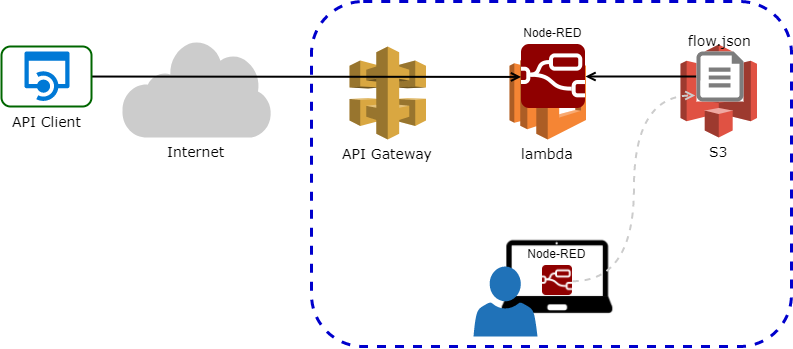

# Node-RED on AWS Lambda using Amazon API Gateway and S3

## Overview



## Quick Start

### Steps for running the Node-RED on lambda using API Gateway and S3
This guide assumes you have already [set up an AWS account](http://docs.aws.amazon.com/AmazonSimpleDB/latest/DeveloperGuide/AboutAWSAccounts.html) and have the latest version of the [AWS CLI](https://aws.amazon.com/cli/) installed.

1. From your preferred project directory:

    ```
    git clone https://github.com/sakazuki/aws-serverless-node-red.git
    cd aws-serverless-node-red
    ```

2. Run the following command to configure with your variables.
    ```
    AWS_ACCOUNT_ID=123456789012
    S3_BUCKET=node-red123
    AWS_REGION=us-west-2
    AWS_FUNCNAME=funcname123
    AWS_STACK_NAME=Node-RED
    npm run config -- --account-id="${AWS_ACCOUNT_ID}" \
    --bucket-name="${S3_BUCKET}" \
    --region="${AWS_REGION}" \
    --function-name="${AWS_FUNCNAME}" \
    --stack-name="${AWS_STACK_NAME}"
    ```

    This modifies the following files with your account ID, bucket, region, function name and stack name (region defaults to `us-east-1` and function name defaults to `slsNodeREDFunction`). 
    - `package.json`
    - `simple-proxy-api.yaml`
    - `cloudformation.yaml`
    - `settings.js` 
    
    If the bucket you specify does not yet exist, the next step will create it for you. This step modifies the existing files in-place; if you wish to make changes to these settings, you will need to modify these files manually.

3. Run the following command to installs the node dependencies, creates an S3 bucket (if it does not already exist), packages and deploys your serverless Express application to AWS Lambda, and creates an API Gateway proxy API.
    ```
    npm run setup

    ### Windows users:
    npm run win-setup
    ```

4. Make a Node-RED flow on local PC

    ```
    node node_modules/.bin/node-red -s ./settings.js
    ```

    open `http://localhost:1880` and make a flow using a `HTTP in` node.
    You can test it with local PC.
    `flow.json` is saved on S3 bucket.

5. After the local test, You can test it using API Gateway.  
open the AWS CloudFormation console https://console.aws.amazon.com/cloudformation/home and switch to the region you specified. Select the `slsNodeREDStack` stack, then click the `ApiUrl` value under the __Outputs__ section - this will open a new page with your running API.  
    Or  
    you can get `ApiUrl` from the output of the following command.
    ```
    aws cloudformation describe-stacks --stack-name ${AWS_STACK_NAME} \
    --output json --query "Stacks[*].Outputs"
    ```

6. If you would prefer to delete AWS assets that were just created, simply run `npm run delete-stack` to delete the CloudFormation Stack, including the API and Lambda Function. If you specified a new bucket in the `config` command for step 1 and want to delete that bucket, run `npm run delete-bucket`.

## Version
- Node.js version 6.10
- Node-RED version 0.18.7

## Resource

this directory includes 

- [Swagger file](http://swagger.io/specification/)
- [CloudFormation template](https://aws.amazon.com/cloudformation/aws-cloudformation-templates/)
- [Serverless Application Model (SAM)](https://github.com/awslabs/serverless-application-model)
- helper scripts to help you set up and manage your application.

## Reference
See the more details on how to customize an existing (or create a new) Node.js project based on this example. 
- [aws-serverless-express](https://github.com/awslabs/aws-serverless-express)
- [Qiita (Japanese)](https://qiita.com/sakazuki/private/9d55ac14432e73524e04)
